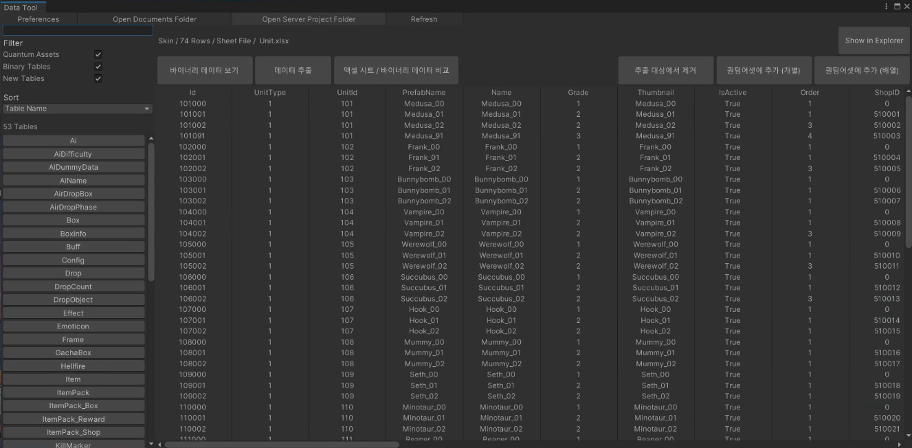
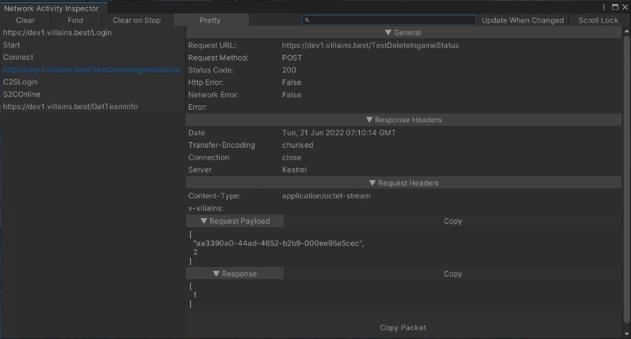
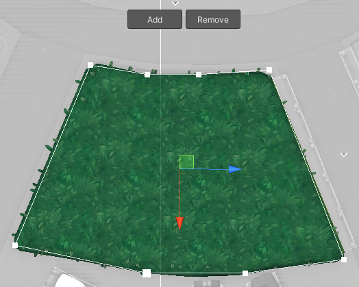
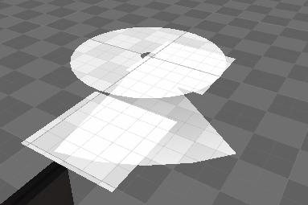
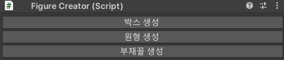
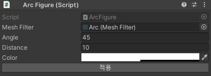
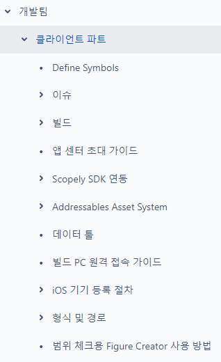

# About Me
### Introduction
- 안녕하세요! 모바일 게임 클라이언트 개발자 백윤식입니다.
- 읽기 좋은 코드를 추구하며 팀내 코드 컨벤션을 중요시합니다.
- 생산성 향상, 워크플로우에 대한 토론을 즐깁니다.
- 게임 기획 참여 경험이 다수 있으며 기획에 함께 참여하여 같이 게임을 만들어나가고 완성도를 높이는걸 선호합니다.
- 개발 외 다른 파트와도 의사소통이 원활합니다.

### Contact & Channel
- Email | colossusplus@naver.com
- Github | https://github.com/kratia

# Skills
### Game Client
- C#
- Unity3d
- Photon Quantum
- WinForms, WPF

### Native
- Java, Objective-C
- Android, iOS

### Interests
- Spine
- UniRx
- UniTask
- Dotween

### DevOps
- Jenkins
- App Center

### Collaboration
- Jira, Confluence
- Trello, Asana
- Slack, flex

### Version Control
- Github (GitBash, Sourcetree, GithubDesktop)
- SVN

### Third Party Plugin
- Firebase, Appsflyer, Flurry
- Google Ads, IronSource
- GPGS
- Apple Login / Google Login
- Facebook

### Certificate / License
- 정보처리 기사

# Projects
### Villains (https://villainsrobotbr.onelink.me/xRd8/villains)
- 포켓게이머(영국) 선정 소프트 런칭 중인 글로벌 탑 50게임 중 3위(https://www.etnews.com/20210219000035)
- 인벤 기사 (https://www.inven.co.kr/webzine/news/?news=290161)

#### 개발
- Photon Quantum 기반의 클라이언트 개발
- 엑셀 기반 기획 데이터 추출 툴 제작
- 전체적인 코드 구조 설계
- UI 팝업 및 화면 양산을 위한 시스템 설계
- 캐릭터 및 스킬 양산을 위한 시스템 설계
- 각종 개발 편의를 위한 시스템 개발
- 캐릭터 시스템 개발
- 아이템 시스템 개발
- 프로젝타일 시스템 개발
- 치트 시스템 개발
- AI 시스템 개발
- 사운드 시스템 개발
- 다수의 캐릭터 스킬 개발
- 게임 테스트 편의를 위한 시스템 개발
- 이펙트, 애니메이션 테스트 편의를 위한 시스템 개발
- 맵 오브젝트 배치 편의를 위한 시스템 개발
- ScriptableObject를 사용하여 기획, 아트 파트에서 수치 조절이 가능하도록 개발
- Hive, Facebook, Firebase 등의 다수의 SDK 적용
- Google / Apple 로그인 개발
- Jenkins 사용한 빌드 환경 개발
- PacketMonitor 제작

#### 기획
- 전체 테이블 구조 설계
- 캐릭터 스킬 및 밸런스 기획
- 맵 구역 및 요소 기획

#### 기타
- 지원사업 및 퍼블리셔 계약을 위한 소프트 런칭 단기 작업
- 개발팀 일정 관리
- BTS 담당자 지정 (모든 파트)
- 신규 기획 전체적인 검토


### Mad For Dance (https://www.birdletter.com/mad-for-dancce)
- 2019년 Google 창구 프로그램 오디션 1위 (http://www.inven.co.kr/webzine/news/?news=227414)

#### 개발
- 1인 클라이언트 개발 (게임의 모든 컨텐츠 및 시스템 개발)
- UGUI를 이용한 UI 개발
- UniRx(MVP Pattern)를 이용한 개발
- 2D/3D 카메라 시스템
- InApp (결제, 복구, 영수증 검증)
- IronSource, GoogleAds 광고 시스템
- Firebase, Appsflyer, Facebook, GPGS 등 SDK 개발
- Unity AssetBundle(리소스), Google DocsPin(테이블)을 이용 패치 시스템
- 테이블 기반 캐릭터(Clubber) 데이터/컴포넌트 자동 생성 시스템
- 오프라인 상태에서도 플레이 가능하도록 데이터 보안 시스템 설계 및 개발
- 밸런스 확인을 위한 툴 개발(유저의 특성을 반영한 각종 레벨별 플레이 타임 계산기)
- BigInterger 계산 최적화
- 라이브 서비스 대응 업무

#### 기획
- Table 데이터 구조 설계
- 다수의 컨텐츠/시스템 기획 (마이클럽, 사진 및 GIF 촬영, 미니게임, 소셜, 기간제 이벤트 등)
- 다수의 연출 기획 (UI, 챕터 전환, 보상 등)
- 밸런스 기획 (직접 개발한 밸런스 확인용 툴을 이용한 밸런스 기획)
- BM 설계 (스타터 패키지, 유료 캐릭터 패키지, 마이클럽 상품 등)
- 광고 기획 (유저당 광고 실행 횟수 IronScource 데이터 기반 상위 1% 달성)
- Google 창구 프로그램 오디션 전용 빌드 기획 
 (실질적인 플레이타임을 계산해 게임밸런스를 그에 맞는 버전으로 맞춰서 유저 플레이 경험 최적화)

#### 기타
- Particle 작업 (리소스 포함)
- Shader 작업
- PostProcessing 작업
- AudioMixer 기반의 사운드 시스템
- 리소스 최적화


### Match3D : Life is Pair (https://apps.apple.com/no/app/match-3d-life-is-pair/id1554432391)

#### 개발
- Spine 활용한 캐릭터 애니메이션
- 게임내 물체 테이블 기반 자동 생성 시스템 (Mesh 최적화 포함)
- Web/Socket 서버 개발
- symlink기반 국가별 리소스 스위치 시스템
- 인게임 시스템 전반
- 레벨 자동 생성 툴 개발
- 라이브 서비스 대응 

#### 기타
- Table 데이터 구조 설계
- 다수의 연출 기획 및 개발 (UI, 인게임 효과 등)


### ETC Projects (https://github.com/kratiapp/PP/blob/main/ETC_Projects.pdf)
#### 기타 프로젝트에 대한 설명은 위 링크를 참조해주세요


# Work Experience

### Reflection을 사용한 처리
```cs
public static Dictionary<int, T> MakeEventInstanceDictionary<T>()
{
    var type = typeof(T);
    var items = new Dictionary<int, T>();
    var assembly = Assembly.GetExecutingAssembly();
    var derivedTypes = assembly.GetTypes().Where(x => type.IsAssignableFrom(x) && x != type);
    var numberRegex = new Regex($"{type.Name}([0-9]+)", RegexOptions.Compiled);

    foreach (var derivedType in derivedTypes)
    {
        var match = numberRegex.Match(derivedType.Name);

        if (match.Success)
        {
            var id = int.Parse(match.Groups[1].Value);

            items[id] = (T)Activator.CreateInstance(derivedType);
        }
    }

    return items;
}
```

### Symlink를 이용한 리소스 관리
(https://github.com/karl-/unity-symlink-utility)
- 국가별 리소스/데이터가 다른 부분을 파일 스위치를 통해서 관리

```cs
private static void SwitchSymlinkToPath(string name)
{
    var platformBasePath = Path.Combine(SpecificAssetsPath, name);

    AssetDatabase.Refresh();

    for (var i = 0; i < specificAssetFolders.Length; i++)
    {
        var target = specificAssetFolders[i];
        var source = Path.Combine(platformBasePath, target);

        if (!Directory.Exists(source))
            Directory.CreateDirectory(source);
#if UNITY_EDITOR_WIN
        Execute($"rd \"{target}\"");
#elif UNITY_EDITOR_OSX
        Execute($"unlink \"{target}\"");
#endif
        File.Delete(target + ".meta");

        if (!string.IsNullOrEmpty(name))
        {
            var targetPath = Path.GetFullPath(target);
            var sourcePath = Path.GetFullPath(source);

#if UNITY_EDITOR_WIN
            Execute($"rd \"{target}\"");
            Execute($"mklink /j \"{targetPath}\" \"{sourcePath}\"");
#elif UNITY_EDITOR_OSX
            sourcePath = sourcePath.Replace(" ", "\\ ");
            targetPath = targetPath.Replace(" ", "\\ ");

            Execute($"ln -s {sourcePath} {targetPath}");
#endif
            var attributeFilePath = Path.Combine(sourcePath, AttributeFileName);

            if (File.Exists(attributeFilePath))
                File.Delete(attributeFilePath);

            File.WriteAllText(attributeFilePath, name + " ");
            File.SetAttributes(attributeFilePath, FileAttributes.Hidden);

            foreach (var buildTarget in GetWorkingBuildTargetGroups())
                SetDefineSymbol(buildTarget, name.ToUpper());
        }
    }

    symlinkMarkerCache.Clear();

    AssetDatabase.Refresh();
}
```


### 빌드 개선 사례

* 문제: URP 사용시 미사용 텍스쳐가 빌드에 포함되는 이슈
* 해결: OnPreprocessBuild에서 해당 텍스쳐 제거 후 빌드 하도록 개선

```cs
public class RemoveURPTextures : IPreprocessBuildWithReport
{
    public int callbackOrder { get { return 0; } }

    public void OnPreprocessBuild(BuildReport report)
    {
        string packagesPath = Application.dataPath.Replace("/Assets", "") + "/Library/PackageCache";
        string[] directories = Directory.GetDirectories(packagesPath);

        foreach (string directory in directories)
        {
            if (directory.Contains("com.unity.render-pipelines.universal"))
            {
                string texturesPath = Path.Combine(directory, "Textures/FilmGrain");
                string[] files = Directory.GetFiles(texturesPath, "*.meta");

                foreach (string filename in files)
                {
                    string[] lines = File.ReadAllLines(filename);

                    for (int i = 0; i < lines.Length; i++)
                    {
                        lines[i] = lines[i].Replace("maxTextureSize: 2048", "maxTextureSize: 32");
                    }

                    File.WriteAllLines(filename, lines);
                }
            }
        }
    }
}
```


### 프리팹 자동 설정 코드

- Match3d 프로젝트에서 인게임 객체를 데이터를 참조하여 자동생성
- MeshCollider의 경우 Optimize하여 생성 (https://github.com/Whinarn/UnityMeshSimplifier 사용)

```cs
[MenuItem("Match3D/Update Entities")]
private static void UpdateEntities()
{
    const string modelPath = "Assets/Graphics/Models/Entities";
    const string targetPath = "Assets/Resources/Entities";

    // Get exist prefabs
    var unusedFilePaths = new HashSet<string>(new PathComparer());

    foreach (var guid in AssetDatabase.FindAssets("t:Prefab", new string[] { targetPath }))
        unusedFilePaths.Add(AssetDatabase.GUIDToAssetPath(guid));

    var generatedPaths = Directory.GetDirectories(modelPath, "Generated", SearchOption.AllDirectories);

    foreach (var generatedPath in generatedPaths)
    {
        foreach (var path in Directory.GetFiles(generatedPath, "*.asset"))
            unusedFilePaths.Add(path);

        foreach (var path in Directory.GetFiles(generatedPath, "*.mat"))
            unusedFilePaths.Add(path);
    }

    // Initialize XML Serializer
    var xmlSerializer = new XmlSerializer(typeof(EntityUpdateProperties));

    // Initialize MeshSimplifier
    var meshSimplifier = new UnityMeshSimplifier.MeshSimplifier();

    meshSimplifier.EnableSmartLink = true;
    meshSimplifier.PreserveUVFoldoverEdges = true;
    meshSimplifier.PreserveUVSeamEdges = true;
    meshSimplifier.PreserveBorderEdges = true;

    // Generate prefab from FBX
    var modelGuids = AssetDatabase.FindAssets("t:Model", new string[] { modelPath });

    for (var i = 0; i < modelGuids.Length; i++)
    {
        var modelGuid = modelGuids[i];
        var path = AssetDatabase.GUIDToAssetPath(modelGuid);
        var originalName = Path.GetFileNameWithoutExtension(path);
        var prefabName = ObjectNames.NicifyVariableName(originalName).Replace(" ", "");

        EditorUtility.DisplayProgressBar("Processing...", path, i / (float)modelGuids.Length);

        var directory = Path.GetDirectoryName(path);
        var outputDirectory = Path.Combine(directory, "Generated");
        var modelAsset = (GameObject)AssetDatabase.LoadMainAssetAtPath(path);
        var modelMesh = modelAsset.GetComponentInChildren<MeshFilter>().sharedMesh;
        var modelMaterial = modelAsset.GetComponentInChildren<MeshRenderer>().sharedMaterial;

        var updateProperties = default(EntityUpdateProperties);

        var xmlPath = Path.ChangeExtension(path, ".xml");

        if (File.Exists(xmlPath))
        {
            using (var stream = new FileStream(xmlPath, FileMode.Open, FileAccess.Read))
                updateProperties = (EntityUpdateProperties)xmlSerializer.Deserialize(stream);
        }

        // Create output directory
        if (!Directory.Exists(outputDirectory))
            Directory.CreateDirectory(outputDirectory);

        // Main GameObject
        var gameObject = new GameObject();

        gameObject.layer = LayerMask.NameToLayer("Entity");

        // Render GameObject
        var renderGameObject = new GameObject("Renderer");

        renderGameObject.transform.SetParent(gameObject.transform, false);

        // Collider
        if (updateProperties?.Sphere != null)
        {
            var sphereCollider = gameObject.AddComponent<SphereCollider>();

            sphereCollider.radius = updateProperties.Sphere.Radius;
            sphereCollider.center = new Vector3(updateProperties.Sphere.X, updateProperties.Sphere.Y, updateProperties.Sphere.Z);
        }
        else if (updateProperties?.Box != null)
        {
            var boxCollider = gameObject.AddComponent<BoxCollider>();

            boxCollider.size = new Vector3(updateProperties.Box.SizeX, updateProperties.Box.SizeY, updateProperties.Box.SizeZ);
            boxCollider.center = new Vector3(updateProperties.Box.X, updateProperties.Box.Y, updateProperties.Box.Z);
        }
        else
        {
            // Process MeshSimplifier
            var simplifiedMeshPath = Path.Combine(outputDirectory, Path.GetFileNameWithoutExtension(path) + "-Optimized.asset");

            meshSimplifier.Initialize(modelMesh);
            meshSimplifier.SimplifyMesh(0.65f);

            var simplifiedMesh = meshSimplifier.ToMesh();

            MeshUtility.Optimize(simplifiedMesh);

            AssetDatabase.CreateAsset(simplifiedMesh, simplifiedMeshPath);
            AssetDatabase.SaveAssets();

            unusedFilePaths.Remove(simplifiedMeshPath);

            // MeshFilter
            var meshFilter = gameObject.AddComponent<MeshFilter>();

            meshFilter.sharedMesh = simplifiedMesh;

            var meshCollider = gameObject.AddComponent<MeshCollider>();

            meshCollider.convex = true;
        }

        // Render: MeshFilter
        var renderMeshFilter = renderGameObject.AddComponent<MeshFilter>();

        renderMeshFilter.sharedMesh = modelMesh;

        // Render: MeshRenderer
        var meshRenderer = renderGameObject.AddComponent<MeshRenderer>();

        meshRenderer.sharedMaterial = modelMaterial;

        // Rigidbody
        gameObject.AddComponent<Rigidbody>();

        // Entity
        var entity = gameObject.AddComponent<Entity>();

        entity.RenderObject = renderGameObject;

        // Save
        var prefabPath = Path.Combine(targetPath, prefabName + ".prefab");

        PrefabUtility.SaveAsPrefabAsset(gameObject, prefabPath);

        unusedFilePaths.Remove(prefabPath);

        // Generate texture variants
        var variantTextureGuids = AssetDatabase.FindAssets(originalName + "_ t:Texture", new string[] { directory });

        foreach (var variantTextureGuid in variantTextureGuids)
        {
            var variantTexturePath = AssetDatabase.GUIDToAssetPath(variantTextureGuid);
            var match = Regex.Match(Path.GetFileNameWithoutExtension(variantTexturePath), Regex.Escape(originalName) + "_([0-9][0-9])_.+");

            if (match.Success)
            {
                var variantName = $"{prefabName}_{match.Groups[1]}";

                // Material
                var cloneMaterial = new Material(modelMaterial);
                var variantTexture = (Texture)AssetDatabase.LoadMainAssetAtPath(variantTexturePath);
                var variantMaterialPath = Path.Combine(outputDirectory, variantName + ".mat");

                cloneMaterial.SetTexture("_BaseMap", variantTexture);

                AssetDatabase.CreateAsset(cloneMaterial, variantMaterialPath);

                unusedFilePaths.Remove(variantMaterialPath);

                // Prefab
                var variantPrefabPath = Path.Combine(targetPath, variantName + ".prefab");

                meshRenderer.sharedMaterial = cloneMaterial;

                PrefabUtility.SaveAsPrefabAsset(gameObject, variantPrefabPath);

                unusedFilePaths.Remove(variantPrefabPath);
            }
        }

        // Cleanup
        DestroyImmediate(gameObject);
    }

    // Clean unused prefabs
    foreach (var path in unusedFilePaths)
    {
        Debug.Log($"UpdateEntities: '{path}' removed");

        AssetDatabase.DeleteAsset(path);
    }

    EditorUtility.ClearProgressBar();
}
```

## 툴 제작
### 데이터 툴 및 바이너리 파일 포맷 제작
엑셀 형태의 기획/테이블 데이터를 제작한 바이너리 포맷으로 변환해주는 툴 제작

- 엑셀 데이터를 바이너리 데이터로 변환
- 데이터 오브젝트 클래스와 Deserialize 코드를 자동생성
- ScriptableObject, Enum 등 지원
- 데이터 변조방지



### 패킷 모니터
서버/클라이언트 파트뿐 아니라 에디터 환경에서의 버그나 이슈와 같은 특정 상황에서의 패킷 Request/Response 값을 간편하게 복사하고 
의사소통할 수 있는 툴 제작



### PolygonToMesh를 이용한 콜라이더 처리
- 에디터상에서 맵의 부시영역을 그리기위해 개발된 툴
- TPPLPartition을 사용한 삼각측량 사용 (https://github.com/ivanfratric/polypartition)

```cs
[CustomEditor(typeof(PolygonToMesh), false)]
public class PolygonToMeshEditor : GraphicEditor
{
    private static bool isPointMoving = false;
    private static PolygonToMesh selectedObject;
    private static int selectedIndex = -1;

    protected override void OnEnable()
    {
        Undo.undoRedoPerformed += OnUndoRedoPerformed;

        if (target is PolygonToMesh polygonToMesh && !polygonToMesh.TryGetComponent<MeshFilter>(out _))
            UpdateMesh(polygonToMesh);
    }

    protected override void OnDisable()
    {
        Undo.undoRedoPerformed -= OnUndoRedoPerformed;

        if (target is PolygonToMesh polygonToMesh && selectedObject == polygonToMesh)
            selectedObject = null;
    }

    private void OnSceneGUI()
    {
        if (!(target is PolygonToMesh polygonToMesh))
            return;

        const float handleScale = 0.05f;
        const float snapSize = 0.5f;

        var points = polygonToMesh.Points;

        // Initialize transform
        var previousMatrix = Handles.matrix;
        var transform = polygonToMesh.transform;

        Handles.matrix = transform.localToWorldMatrix;

        // Draw lines
        Handles.color = Color.white;

        for (var i = 0; i < points.Count; i++)
        {
            var previous = i == 0 ? points.Count - 1 : i - 1;

            Handles.DrawLine(points[previous], points[i]);
        }

        // Handle
        var currentEvent = Event.current;
        var previousEventType = currentEvent.type;

        for (var i = 0; i < points.Count; i++)
        {
            var point = points[i];
            var handleSize = HandleUtility.GetHandleSize(point) * handleScale;

            if (selectedObject == polygonToMesh && selectedIndex == i)
                handleSize *= 1.5f;

            EditorGUI.BeginChangeCheck();

            var controlId = GUIUtility.GetControlID(FocusType.Passive);
            var handled = Handles.FreeMoveHandle(controlId, point, Quaternion.identity, handleSize, Vector3.one, Handles.DotHandleCap);

            if (previousEventType == EventType.MouseDown && GUIUtility.hotControl == controlId && currentEvent.GetTypeForControl(controlId) == EventType.Used)
            {
                selectedObject = polygonToMesh;
                selectedIndex = i;
            }

            if (EditorGUI.EndChangeCheck())
            {
                Undo.RecordObject(target, "Move polygon point");

                handled.x = Mathf.Round(handled.x / snapSize) * snapSize;
                handled.y = 0.0f;
                handled.z = Mathf.Round(handled.z / snapSize) * snapSize;

                points[i] = handled;

                isPointMoving = true;
            }
        }

        // Bake if changed
        if (isPointMoving)
        {
            if (GUIUtility.hotControl == 0)
            {
                UpdateMesh(polygonToMesh);

                isPointMoving = false;
            }
        }

        // Scene UI
        var buttonWidth = GUILayout.Width(80.0f);
        var buttonHeight = GUILayout.Height(28.0f);

        Handles.BeginGUI();
        EditorGUILayout.BeginHorizontal();
        GUILayout.FlexibleSpace();

        EditorGUI.BeginDisabledGroup(selectedObject != polygonToMesh || selectedIndex < 0 || selectedIndex >= points.Count);
        {
            // Add
            if (GUILayout.Button("Add", buttonWidth, buttonHeight))
            {
                Undo.RecordObject(target, "Add Point");

                var previous = selectedIndex == 0 ? points.Count - 1 : selectedIndex - 1;
                var center = (points[selectedIndex] + points[previous]) / 2.0f;

                polygonToMesh.Points.Insert(selectedIndex, center);
            }

            GUILayout.Space(2.0f);

            // Remove
            EditorGUI.BeginDisabledGroup(points.Count <= 3);
            {
                if (GUILayout.Button("Remove", buttonWidth, buttonHeight))
                {
                    Undo.RecordObject(target, "Remove Point");

                    polygonToMesh.Points.RemoveAt(selectedIndex);

                    UpdateMesh(polygonToMesh);

                    selectedIndex = -1;
                }
            }
            EditorGUI.EndDisabledGroup();
        }
        EditorGUI.EndDisabledGroup();

        GUILayout.FlexibleSpace();
        EditorGUILayout.EndHorizontal();
        Handles.EndGUI();

        // Restore transform
        Handles.matrix = previousMatrix;
    }

    private void OnUndoRedoPerformed()
    {
        if (target is PolygonToMesh polygonToMesh)
            UpdateMesh(polygonToMesh);
    }

    public override void OnInspectorGUI()
    {
        // Draw script
        serializedObject.UpdateIfRequiredOrScript();

        var property = serializedObject.GetIterator();
        var expanded = true;

        while (property.NextVisible(expanded))
        {
            switch (property.propertyPath)
            {
                case "m_Script":
                    using (new EditorGUI.DisabledScope(true))
                        EditorGUILayout.PropertyField(property, true);

                    break;

                case nameof(PolygonToMesh.Color):
                    EditorGUI.BeginChangeCheck();

                    EditorGUILayout.PropertyField(property, true);

                    if (EditorGUI.EndChangeCheck() && target is PolygonToMesh polygonToMesh)
                        UpdateMesh(polygonToMesh);

                    break;

                // Hide other properties
                default:
                    break;
            }

            expanded = false;
        }

        serializedObject.ApplyModifiedProperties();
    }

    public static void UpdateMesh(PolygonToMesh polygonToMesh)
    {
        var meshFilter = polygonToMesh.gameObject.GetOrAddComponent<MeshFilter>();
        var meshRenderer = polygonToMesh.gameObject.GetOrAddComponent<MeshRenderer>();

        // Detect duplicated mesh
        var otherPolygonToMeshes = FindObjectsOfType<PolygonToMesh>().Where(x => x != polygonToMesh);
        var otherMeshes = otherPolygonToMeshes.Select(x => x.TryGetComponent<MeshFilter>(out var m) ? m.sharedMesh : null);

        if (meshFilter.sharedMesh != null && otherMeshes.Contains(meshFilter.sharedMesh))
            meshFilter.sharedMesh = null;

        // Material
        meshRenderer.sharedMaterial = AssetDatabase.LoadAssetAtPath<Material>("Assets/Graphics/Materials/DevelopmentMesh.mat");

        // Mesh
        var mesh = meshFilter.sharedMesh;

        if (mesh == null)
            mesh = meshFilter.sharedMesh = new Mesh();

        // Triangulate
        var polygon = polygonToMesh.Points.Select(x => x.ToVector2XZ()).ToList();
        var signedArea = 0.0f;

        for (var i = 0; i < polygon.Count; i++)
        {
            var previous = i == 0 ? polygon.Count - 1 : i - 1;

            signedArea += polygon[previous].x * polygon[i].y - polygon[i].x * polygon[previous].y;
        }

        if (signedArea < 0)
            polygon.Reverse();

        var triangulated = TPPLPartition.Triangulate_EC(polygon);

        mesh.SetIndices(new int[0], MeshTopology.Triangles, 0);

        if (triangulated != null)
        {
            var vertices = triangulated.SelectMany(x => x.Reverse<Vector2>()).Select(y => y.ToVector3XZ()).ToArray();
            var indices = new int[vertices.Length];
            var colors = new Color[vertices.Length];

            for (var i = 0; i < vertices.Length; i++)
            {
                indices[i] = i;
                colors[i] = polygonToMesh.Color;
            }

            mesh.SetVertices(vertices);
            mesh.SetColors(colors);

            mesh.SetIndices(indices, MeshTopology.Triangles, 0);
        }

        mesh.RecalculateBounds();
    }
}
```


### 스킬 범위 확인용 툴
- 에디터에서 Box/Circle/Arc 형태 등의 메쉬를 동적 생성하여 스킬 범위를 확인할수 있도록 개발

```cs
public class FigureCreator : MonoBehaviour
{
    public void CreateFigure(FigureType type)
    {
        var figure = Instantiate((EditorGUIUtility.Load($"{type}Figure.prefab") as GameObject));

        figure.transform.SetParent(this.transform);
        figure.transform.localPosition = Vector3.zero;

        Undo.RegisterCreatedObjectUndo(figure, "Create " + figure.name);
        Selection.activeObject = figure;
    }

    [MenuItem("GameObject/Custom/Figure Creator", false, 10)]
    public static void CreateFigureMenuItem(MenuCommand menuCommand)
    {
        var go = Instantiate((EditorGUIUtility.Load($"FigureCreator.prefab") as GameObject));

        GameObjectUtility.SetParentAndAlign(go, menuCommand.context as GameObject);

        Undo.RegisterCreatedObjectUndo(go, "Create " + go.name);
        Selection.activeObject = go;
    }
}

public class ArcFigure : FigureBase
{
    public MeshFilter MeshFilter = null;
    public float Angle = 45;
    public float Distance = 10;
    public Color Color = new Color(1.0f, 1.0f, 1.0f, 0.5f);

    private Mesh mesh;

    private void Initialize()
    {
        MeshFilter.mesh = mesh = new Mesh();
        mesh.MarkDynamic();

        materials = GetComponentsInChildren<Renderer>().Select(x => x.sharedMaterial).ToArray();
    }

    public void SizeChange(float angle, float distance)
    {
        Initialize();

        UpdateArcMesh(angle);

        MeshFilter.transform.localPosition = new Vector3(0.0f, Constants.AimingGuideHeight, 0.0f);
        MeshFilter.transform.localScale = new Vector3(distance, 1.0f, distance);
        MeshFilter.transform.eulerAngles = new Vector3(0.0f, angle * Mathf.Rad2Deg, 0.0f);
    }

    private void UpdateArcMesh(float angle)
    {
        var precision = 32;
        var pieces = Mathf.RoundToInt(precision * (angle / 360.0f));
        var pieceAngle = angle * Mathf.Deg2Rad / pieces;
        var offsetAngle = angle * Mathf.Deg2Rad / 2.0f - Mathf.PI * 0.5f;
        var vertices = new List<Vector3>();
        var colors = new List<Color>();
        var indices = new int[(pieces + 1) * 3];
        var outerColor = Color;
        var innerColor = outerColor;

        innerColor.a /= 3.0f;

        vertices.Add(Vector3.zero);
        colors.Add(innerColor);

        for (int i = 0; i <= pieces; i++)
        {
            float currentAngle = i * pieceAngle - offsetAngle;
            float x = Mathf.Cos(currentAngle);
            float y = Mathf.Sin(currentAngle);

            vertices.Add(new Vector3(x, 0f, y));
            colors.Add(outerColor);
        }

        for (int i = 1; i <= pieces; i++)
        {
            int position = i * 3;

            indices[position] = 0;
            indices[position + 1] = i + 1;
            indices[position + 2] = i;
        }

        mesh.Clear();
        mesh.SetVertices(vertices);
        mesh.SetColors(colors);
        mesh.SetIndices(indices, MeshTopology.Triangles, 0);
        mesh.RecalculateBounds();
    }
}

public class CircleFigure : FigureBase
{
    public MeshFilter CircleMeshFilter;
    public float Size = 5;
    public Color Color = new Color(1.0f, 1.0f, 1.0f, 0.5f);

    private Mesh circleMesh;

    private void Initialize()
    {
        CircleMeshFilter.mesh = circleMesh = GenerateCircleMesh();

        materials = GetComponentsInChildren<Renderer>().Select(x => x.sharedMaterial).ToArray();
    }

    private void OnDestroy()
    {
        CircleMeshFilter.mesh = null;
        Destroy(circleMesh);
    }

    public void SizeChange(float size)
    {
        Initialize();

        CircleMeshFilter.transform.localScale = new Vector3(size, 1.0f, size);
    }

    private Mesh GenerateCircleMesh()
    {
        const int precision = 32;
        const float innerCircleSize = 0.1f;
        const float outerCircleSize = 1.0f;
        var mesh = new Mesh();
        var vertices = new List<Vector3>();
        var colors = new List<Color>();
        var indices = new int[precision * 6];

        for (int i = 0; i < precision; i++)
        {
            var angle = i / (float)precision * Mathf.PI * 2.0f;
            var x = Mathf.Cos(angle);
            var y = Mathf.Sin(angle);

            vertices.Add(new Vector3(x * outerCircleSize, 0f, y * outerCircleSize));
            colors.Add(Color);

            vertices.Add(new Vector3(x * innerCircleSize, 0f, y * innerCircleSize));
            colors.Add(Color);
        }

        for (int i = 0; i < precision; i++)
        {
            int position = i * 6;
            int j = i - 1;

            if (j < 0)
                j = precision - 1;

            indices[position] = i * 2;
            indices[position + 1] = j * 2;
            indices[position + 2] = j * 2 + 1;
            indices[position + 3] = i * 2;
            indices[position + 4] = j * 2 + 1;
            indices[position + 5] = i * 2 + 1;
        }

        mesh.SetVertices(vertices);
        mesh.SetColors(colors);
        mesh.SetIndices(indices, MeshTopology.Triangles, 0);
        mesh.RecalculateBounds();

        return mesh;
    }
}


public class BoxFigure : FigureBase
{
    public MeshFilter MeshFilter = null;
    public Vector2 Size = new Vector2(5, 5);
    public Color Color = new Color(1.0f, 1.0f, 1.0f, 0.5f);

    private void Initialize()
    {
        MeshFilter.mesh = GenerateLineMesh();
        materials = GetComponentsInChildren<Renderer>().Select(x => x.sharedMaterial).ToArray();
    }

    public void SizeChange(Vector2 size)
    {
        Initialize();

        MeshFilter.transform.localPosition = new Vector3(0.0f, Constants.AimingGuideHeight, 0.0f);
        MeshFilter.transform.localScale = new Vector3(size.x, 1.0f, size.y);
    }

    private Mesh GenerateLineMesh()
    {
        var mesh = new Mesh();
        var vertices = new List<Vector3>();
        var colors = new List<Color>();
        var indices = new int[6];

        vertices.Add(new Vector3(-0.5f, 0.0f, 1.0f));
        colors.Add(Color);

        vertices.Add(new Vector3(0.5f, 0.0f, 1.0f));
        colors.Add(Color);

        vertices.Add(new Vector3(-0.5f, 0.0f, 0.0f));
        colors.Add(Color);

        vertices.Add(new Vector3(0.5f, 0.0f, 0.0f));
        colors.Add(Color);

        indices[0] = 0;
        indices[1] = 1;
        indices[2] = 2;
        indices[3] = 1;
        indices[4] = 3;
        indices[5] = 2;

        mesh.SetVertices(vertices);
        mesh.SetColors(colors);
        mesh.SetIndices(indices, MeshTopology.Triangles, 0);

        mesh.RecalculateBounds();

        return mesh;
    }
}
```







## 문서화
각종 가이드, 이슈 대응방법 및 히스토리 관리를 용이하게 하기 위한 꾸준한 문서 작성


